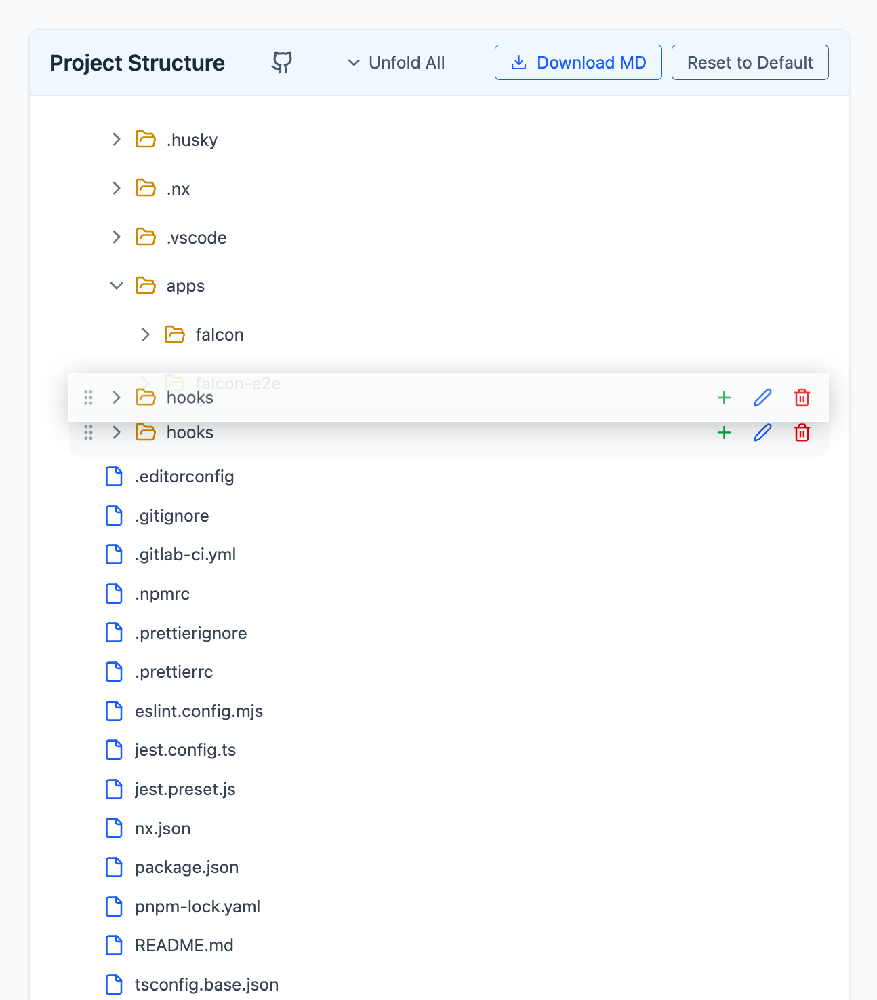

# 🏗️ Project Structure Explorer

[](https://github.com/2rohityadav/project-structure)
[](https://github.com/2rohityadav/project-structure/network/members)
[](https://github.com/2rohityadav/project-structure/issues)
[](https://github.com/2rohityadav/project-structure/blob/main/LICENSE)
[](https://makeapullrequest.com)

[View Demo](https://2rohityadav.github.io/project-structure/) · [Report Bug](https://github.com/2rohityadav/project-structure/issues) · [Request Feature](https://github.com/2rohityadav/project-structure/issues)

A dynamic, interactive file structure explorer built with React and TypeScript. This tool allows users to visualize and manipulate project directory structures with a modern, intuitive interface.



## 🚀 Demo

Try the demo here: [Project Structure Explorer Demo](https://2rohityadav.github.io/project-structure/)

### 📝 Table of Contents

- [✨ Features](#-features)
- [🚀 Installation](#-installation)
- [⚙️ Usage](#-usage)
- [🏗️ Project Structure](#-project-structure)
- [🛠 Technical Details](#-technical-details)
- [🤝 Contributing](#-contributing)
- [📜 License](#-license)
- [📝 Contact](#-contact)
- [🙏 Acknowledgments](#-acknowledgments)
- [💖 Support](#-support)

## ✨ Features

- 🌲 Interactive Tree View

  - Expand/Collapse folders
  - Drag and drop files/folders
  - Add new files and folders
  - Rename existing items
  - Delete items

- 💾 Persistent Storage

  - Automatically saves changes to localStorage
  - Maintains state across page refreshes
  - Reset to default structure option

- 🎯 User Experience

  - Global expand/collapse all functionality
  - Visual feedback for drag and drop operations
  - Mobile-responsive design with desktop mode warning
  - Intuitive icons and hover states

- 🛠 Technical Features
  - TypeScript for type safety
  - React Context for global state
  - Custom hooks for shared logic
  - Modular component architecture
  - Tailwind CSS for styling

## 🚀 Installation

```bash
# Clone the repository
git clone https://github.com/2rohityadav/project-structure.git

# Navigate to project directory
cd project-structure

# Install dependencies
npm install
```

## ⚙️ Usage

```bash
# Start development server
npm run dev

# Build for production
npm run build

# Preview production build
npm run preview
```

## 🏗️ Project Structure

```
src/
├── components/
│   ├── ProjectExplorer/
│   │   ├── index.tsx
│   │   ├── ExplorerHeader.tsx
│   │   └── ExpandCollapseButton.tsx
│   └── TreeNode/
│       ├── index.tsx
│       ├── TreeNodeActions.tsx
│       ├── TreeNodeForm.tsx
│       ├── DragHandle.tsx
│       ├── ExpandButton.tsx
│       ├── FileIcon.tsx
│       └── AddItemForm.tsx
├── contexts/
│   ├── TreeContext.ts
│   └── TreeProvider.tsx
├── hooks/
│   └── useTree.ts
├── models/
│   └── TreeContextType.ts
├── services/
│   └── StorageService.ts
└── utils/
    └── treeUtils.ts
```

## 🛠 Technical Details

### Components

- **ProjectExplorer**: Main container component
- **TreeNode**: Recursive component for rendering folders/files
- **ExplorerHeader**: Contains controls and actions
- **Various UI Components**: Modular, reusable components

### State Management

- React Context for global expand/collapse state
- Local state for individual node operations
- LocalStorage for persistence

### TypeScript Interfaces

```typescript
interface TreeNodeContent {
  [key: string]: TreeNodeContent | string[] | null | Record<string, unknown>;
}

interface TreeContextType {
  globalExpanded: boolean;
  toggleGlobalExpanded: () => void;
}
```

## 🤝 Contributing

Contributions are what make the open source community such an amazing place to learn, inspire, and create. Any contributions you make are **greatly appreciated**.

If you have a suggestion that would make this better, please fork the repo and create a pull request. You can also simply open an issue with the tag "enhancement".
Don't forget to give the project a star! Thanks again!

### Development Process

1. Fork the Project
2. Create your Feature Branch (`git checkout -b feature/AmazingFeature`)
3. Commit your Changes (`git commit -m 'Add some AmazingFeature'`)
4. Push to the Branch (`git push origin feature/AmazingFeature`)
5. Open a Pull Request

### Code Style

- Use TypeScript for all new code
- Follow the existing code style
- Write meaningful commit messages
- Update documentation for any new features
- Add tests for new functionality

## 📝 Contact

Rohit Yadav - [X (twitter)](https://twitter.com/__rohityadav)

## 💖 Support

If you like this project, please consider:

- ⭐ Starring the repository
- 🔄 Sharing it with others
- 🐛 Contributing by fixing bugs or adding features
- 📝 Providing feedback and suggestions

## 🙏 Acknowledgments

- Icons provided by [Lucide Icons](https://lucide.dev/)
- Styling with [Tailwind CSS](https://tailwindcss.com/)

## 📜 License

This project is licensed under the MIT License - see the [LICENSE](LICENSE) file for details.
